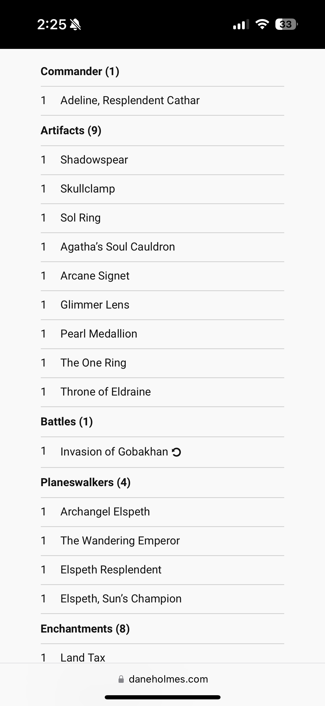
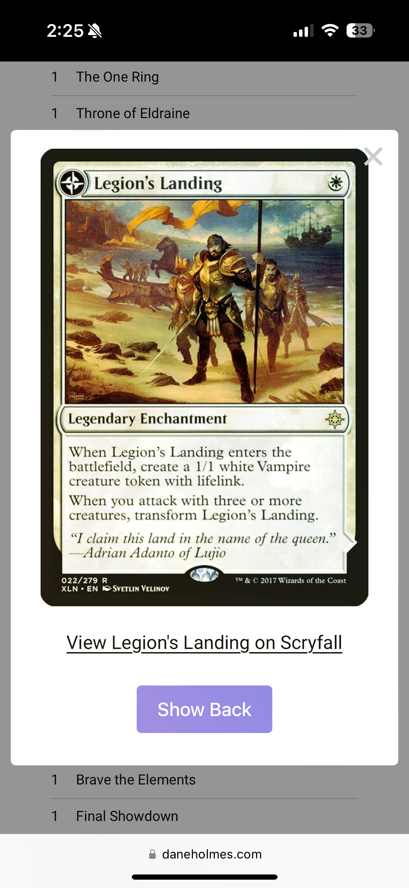
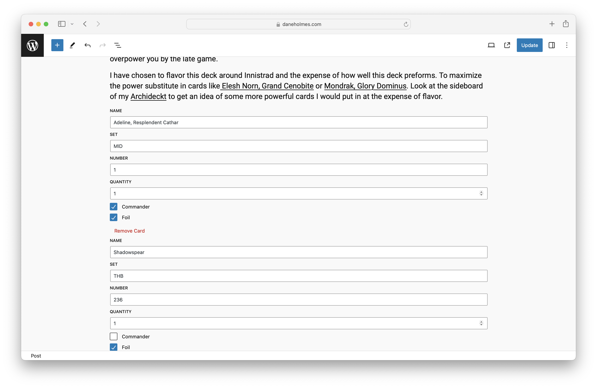

# MTG Tools
Contributors:      Dane Holmes
Tags:              block
Tested up to:      6.5.3
Stable tag:        0.9.0
License:           GPL-3.0-only
License URI:       https://www.gnu.org/licenses/gpl-3.0.html

A plugin for displaying Magic: The Gathering cards on WordPress as Gutenberg Blocks.

## Description

MTG Tools adds a block to the Gutenberg Editor called "Deck." The Deck block allows you to create and display Magic: The Gathering decks by adding card names and/or set and collector numbers. After adding your desired cards, the plugin does all the work, organizing the cards by type and displaying your deck on your website compactly and comprehensively.

## Installation

1. Upload the plugin files to the `/wp-content/plugins/mtg-tools` directory, or install the plugin through the WordPress plugins screen directly.
2. Activate the plugin through the 'Plugins' screen in WordPress

## Frequently Asked Questions

**What are the required inputs?**

A permutation of set code, collector number, and card name must be added to display a card.
1. If you only input card name it will display the most recent printing of the specified card. Note that the name doesn't have to be exact, but will display the exact name.
2. If you put in card name and set code it will display the printing with the lowest collector number from your desired set.
3. If you put in set code and collector number it will display the exact printing. With both set code and collector number card name is effectively optional.

Selecting "Foil" will add a slight foil-like animation to the card image.*Optional*.

Quantity defaults to one and is required.

Selecting "Commander" will designate selected card(s) as your deck's commander. *Optional*.

**How can I find collector number and set code?**.

The set code and the collector numbers are found in the bottom left corner of modern Magic cards. Alternatively, you can look them up using a tool like [Scryfall](https://scryfall.com).

**What Magic formats can this plugin display?**

All 60 card formats and commander.

## Screenshots

## Changelog

**1.0.0**
* Initial release.
