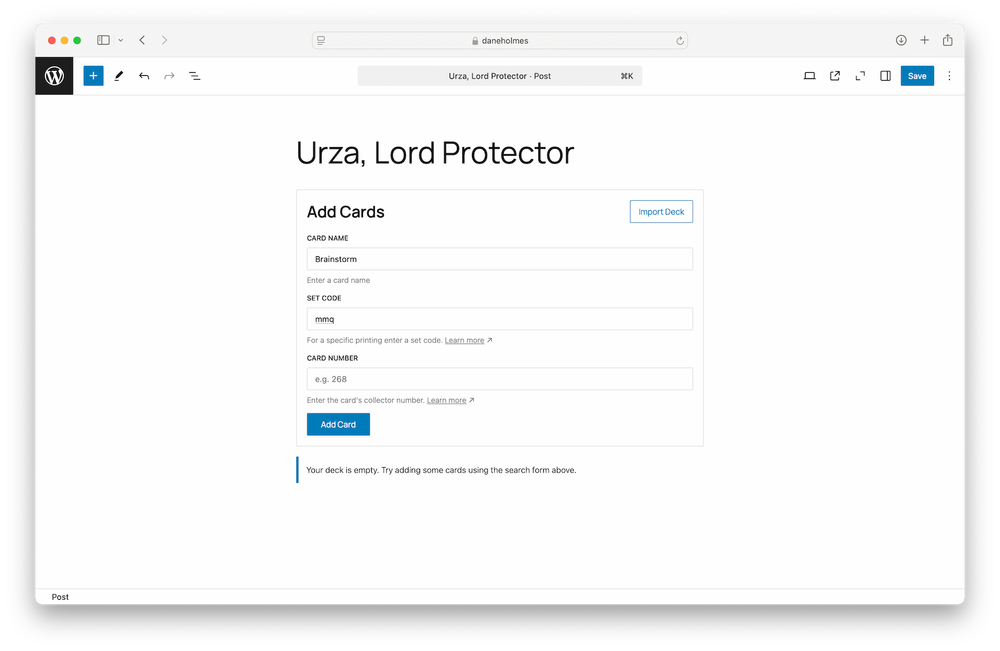

# MTG4WP

MTG4WP is a powerful WordPress plugin that seamlessly displays Magic: The Gathering cards on your WordPress website. With a simple, intuitive Gutenberg block, you can write about Magic showcase card collections with ease.

## Installation

### Method 1: Manual Upload
1. Download the latest release
2. Upload the plugin files to `/wp-content/plugins/MTG4WP`
3. Activate the plugin through the 'Plugins' screen in WordPress

### Method 2: Compilation
```zsh
# Clone the repository
git clone https://github.com/daneholmes/MTG4WP.git

# Navigate to the project directory
cd MTG4WP

# Install dependencies
npm install

# Build the plugin using provided script
./assets\/build\/build.sh
```

## Frequently Asked Questions

**For full documentation please visit: [daneholmes.com/MTG4WP/](https://daneholmes.com/MTG4WP/).**

### Adding a Deck
1. Open a new page or post in the WordPress editor
2. Click "Add Block"
3. Search for "Deck"
4. Add the block to your post

### Finding Collector Numbers and Set Codes
Look in the bottom left corner of modern Magic cards. Or, you can use online resources like [Scryfall](https://scryfall.com) for precise information

## Screenshots
Add cards to your site with simple searches.

Precisely add decks worth of cards with the importer.


## Changelog

### 1.0.0
- Initial release.

## Legal Notices

Magic Decks and Cards is unofficial Fan Content permitted under the [Fan Content Policy](https://company.wizards.com/en/legal/fancontentpolicy). 

**Disclaimer:** Not approved/endorsed by Wizards of the Coast. Portions of the materials used are property of Wizards of the Coast LLC. ©Wizards of the Coast LLC.

## License

This project is licensed under the GNU General Public License v3.0 - see the [LICENSE](https://www.gnu.org/licenses/gpl-3.0.html) for details.
